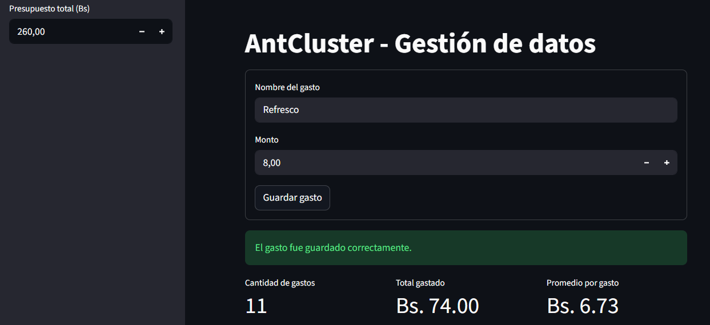
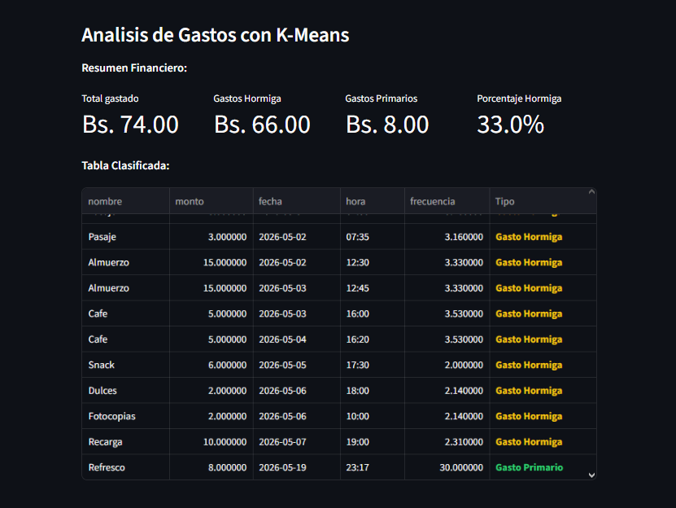

# Reporte de Pruebas de Ejecución

Este documento detalla las pruebas funcionales del prototipo AntCluster, validando el registro de datos, el almacenamiento en formato CSV y el análisis de agrupamiento con K-Means.

## Resumen de Pruebas

| Fase | Descripción | Resultado Esperado | Estado | Evidencia |
|---|---|---|---|---|
| F1 | Registro e Interfaz | Ingreso de transacciones con validación de datos. | Exitoso | Figura 1 |
| F2 | Persistencia CSV | Almacenamiento en data/gastos_usuario.csv. | Exitoso | Figura 1 |
| F3 | Análisis K-Means | Clasificación automática de gastos y cálculo métrico. | Exitoso | Figura 2 |
| F4 | Formateo Visual | Tabla con tipografía coloreada según el tipo de gasto. | Exitoso | Figura 2 |

---

## Casos de Prueba Validados

### Interfaz de Registro

| Código | Caso de Prueba | Resultado |
|---|---|---|
| PR-001 | Inicio de la aplicación | Se despliega el título AntCluster - Gestión de datos. |
| PR-002 | Validación de nombre vacío | El sistema bloquea el registro si falta el nombre del gasto. |
| PR-003 | Validación de monto inválido | El sistema bloquea montos de 0.00 o negativos. |
| PR-004 | Registro exitoso de gasto | Se almacena la transacción y se actualizan los totales en pantalla. |

### Procesamiento y Clustering

| Código | Caso de Prueba | Resultado |
|---|---|---|
| P3-001 | Ejecución K-Means | El algoritmo procesa los gastos y define los centroides correspondientes. |
| P3-002 | Clasificación Semántica | Se asignan las etiquetas Gasto Hormiga y Gasto Primario. |
| P3-003 | Cálculo de Porcentajes | Se calcula el impacto de los gastos hormiga respecto al presupuesto (33.0%). |
| P3-004 | Formateo de Tabla | La columna Tipo muestra texto coloreado en amarillo y verde. |

---

## Evidencias Fotográficas

### Figura 1. Flujo de Registro y Almacenamiento

Descripción: Interfaz principal que muestra el formulario con los datos ingresados para Refresco con un monto de 8.00 Bs, la confirmación de guardado y la actualización de los indicadores generales.

### Figura 2. Resumen Analítico y Segmentación por Color

Descripción: Panel de resultados que despliega los totales calculados por el algoritmo y la tabla ordenada con las etiquetas Gasto Hormiga en color amarillo y Gasto Primario en color verde.